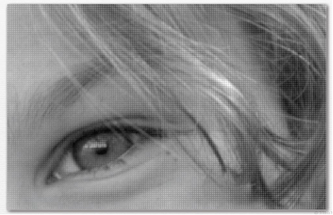
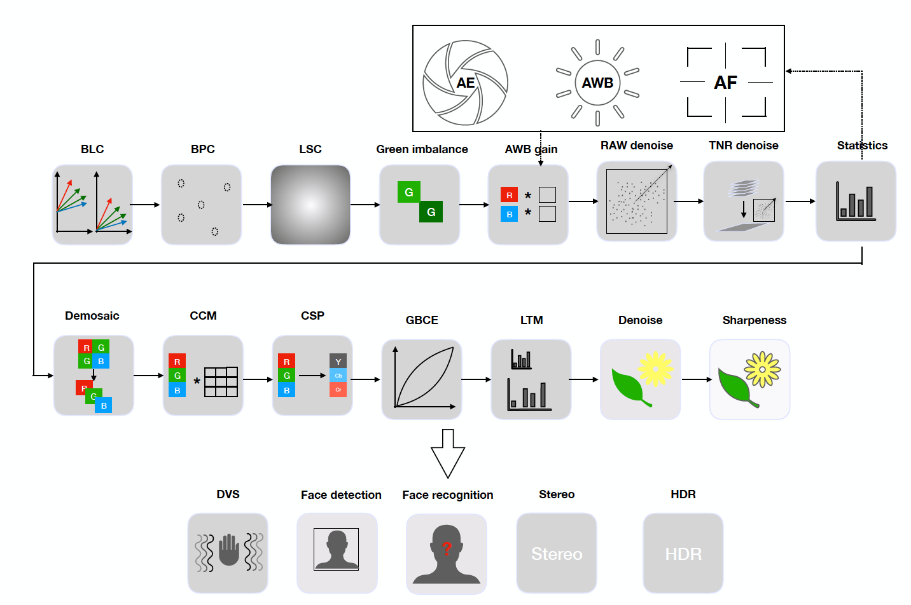
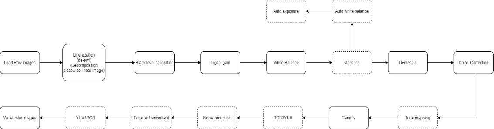

# Parallel Raw Image Processing

15-618 Parallel Computer Architecture and Programming - Final Project

Wei Chen ([wc3@andrew.cmu.edu](wc3@andrew.cmu.edu)), Ran You ([rany2@andrew.cmu.edu](rany2@andrew.cmu.edu))

**Project Topic:**

1. Parallelize and optimize the camera raw image processing pipeline using CUDA.
2. (Optional) Performance comparison with implemetating by Halide. 

## Contents

[Background](#background)

[Challenges](#challenges)

[Workflow and Schedule](#workflow-and-schedule)

## Background

We are going to implement an optimized Camera Raw image processing Pipeline using CUDA on GHC machines. 

The main idea is to convert the RAW image on the left to a color image on the right. 

*Source: CMU 18793 Image and Video Processing lecture 2 slides*

A large number of high-resolution vision cameras are used in computer vision-based autonomous driving applications. For example, a car may have more than ten cameras with 2~8 megapixels cameras. In order to complete the task of autonomous driving, each camera needs at least 20Hz image output, so it needs to be able to complete the RAW image processing in real time. 

Even though a lot of image processing can be done with ISP chips, camera technology in the field of autonomous driving is still developing rapidly, the hardware chips that have been designed cannot quickly adapt to new cameras. There are still a large number of ISP algorithms that can be developed for the new camera technology. If a parallel method can be used to run new algorithms in real-time, it will be very helpful for the testing and optimization of autonomous driving applications. That’s why we want to use CUDA and parallel ideas we learned from 15618 to optimize the image processing pipeline. 

*Source: Goss Imaging Technology online cource*

The entire ISP processing pipeline involves many modules. Including real-time control of exposure and white balance control, as well as image signal processing of different stages of every image. Obviously, image processing tasks need to process a large number of pixels, and the use of parallel can greatly speed up the entire pipeline.

## Challenges

1. The image processing pipeline consists of several different algorithms which need to be run sequentially, which will require the communication or synchronization.
2. Different algorithms in the pipeline have different computation models and data dependence. For example, some algorithms use matrix operation and convolution while others may be totally data independent between each pixel. 
3. In order to process images in real time, there will be a large amount of data access to acquire images and need to deal with the memory access for different cameras. 

## Workflow and Schedule

1. Offline RAW image processing pipeline including **Linearization**, **Black level calibration**, **Digital gain**, **White Balance**, **Demosaic**, **Color Correction** and **Gamma**. Use image files as input of the pipeline instead of a real camera. 
2. Use python to get familiar with the algorithm of the pipeline
3. Baseline sequential algorithm pipeline for Raw image signal processing in C / C++ to convert RAW image to color image
4. Parallelization each part of the algorithm in the pipeline
5. Combine the parallized version of algorithms, try to convert 2 two-megapixels RAW to image color within 50ms to get 20Hz output.
6. Analyze the performance of the parallized and sequential version of code, try to explain the strategy and difficulty we try to parallelize the pipeline. 

### Workflow

Note: Tasks in dashed-line boxes are optional depending on project progress. 

### Schedule

| Week | Tasks                                                        |
| ---- | ------------------------------------------------------------ |
| 1    | Use python and other resources to understand whole RAW image processing algorithm pipeline |
| 2    | Baseline sequential algorithm pipeline for Raw image signal processing |
| 3    | Parallelization first part of algorithm in the pipeline      |
| 4    | Parallelization the rest part of algorithm of the pipeline   |
| 5    | Combine all parallelized algorithm together                  |
| 6    | Performance analysis and report                              |

